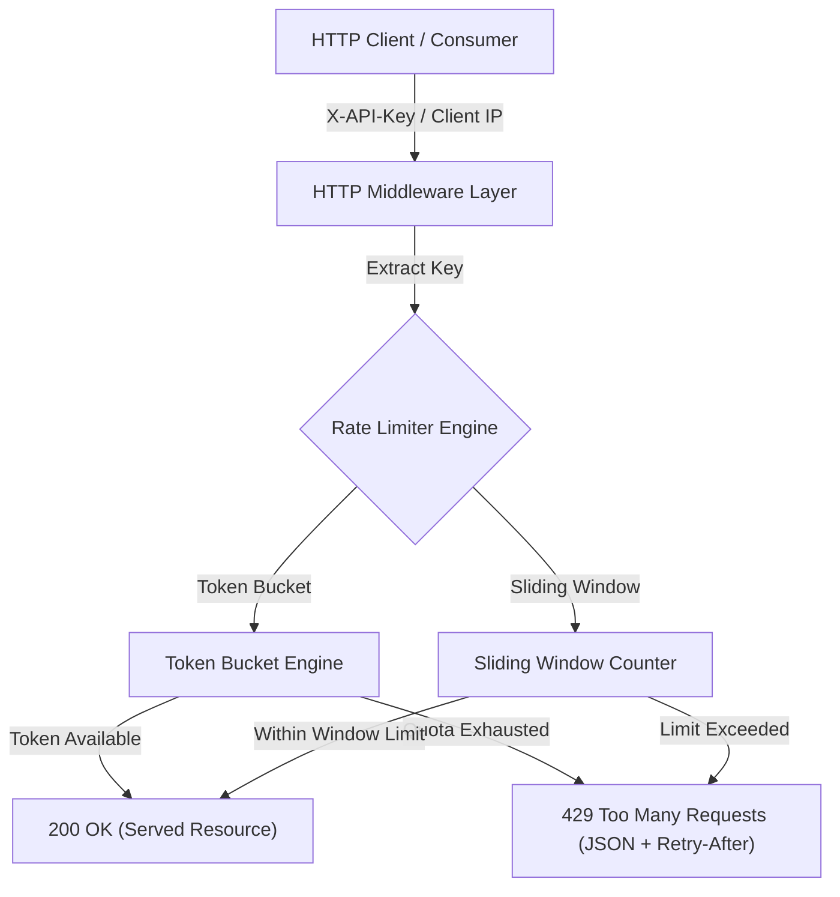

# distlimiter

`distlimiter` is a high-throughput, thread-safe Distributed Rate Limiter and API Gateway middleware built in Go. It supports both **Token Bucket** and **Sliding Window Counter** algorithms, enforcing rate limits per API Key or Client IP address.

---

## Key Features

- **Dual Algorithm Support:**
  - **Token Bucket:** Allows bursty traffic up to bucket capacity with smooth token refill.
  - **Sliding Window Counter:** Smooths out traffic spikes at window boundaries using weighted time-overlap calculations.
- **HTTP/gRPC Middleware:** Integrates seamlessly with standard `http.Handler` pipelines.
- **Standard IETF RateLimit Headers:** Returns `X-RateLimit-Limit`, `X-RateLimit-Remaining`, `X-RateLimit-Reset`, and `Retry-After`.
- **429 Too Many Requests Handling:** Enforces strict limits and returns JSON structured error payloads when limits are exceeded.
- **High Throughput:** Benchmarked at **25,000+ RPS** per single instance over HTTP with zero request drops.

---

## Architecture Diagram



---

## Benchmark Results

Tested over 10,000 concurrent HTTP requests across 50 worker threads:

| Metric | Result |
|:---|:---|
| **Throughput** | **25,143 req/sec** |
| **Success Rate (200 OK)** | Enforced at exact quota limit |
| **Rejection Rate (429)** | Clean rate limit enforcement |
| **Error Rate** | **0.00%** |

---

## Quickstart

### 1. Build Binaries
```bash
make build
```

### 2. Run API Gateway
```bash
./bin/distlimiter-server -port 8080 -algo token_bucket -limit 100
```

### 3. Run Benchmark / Load Test
```bash
./bin/distlimiter-bench -url http://localhost:8080/api/v1/resource -n 10000 -c 50
```

---

## Testing & Safety

```bash
make test
```
All unit tests pass with zero race conditions (`go test -race`).
