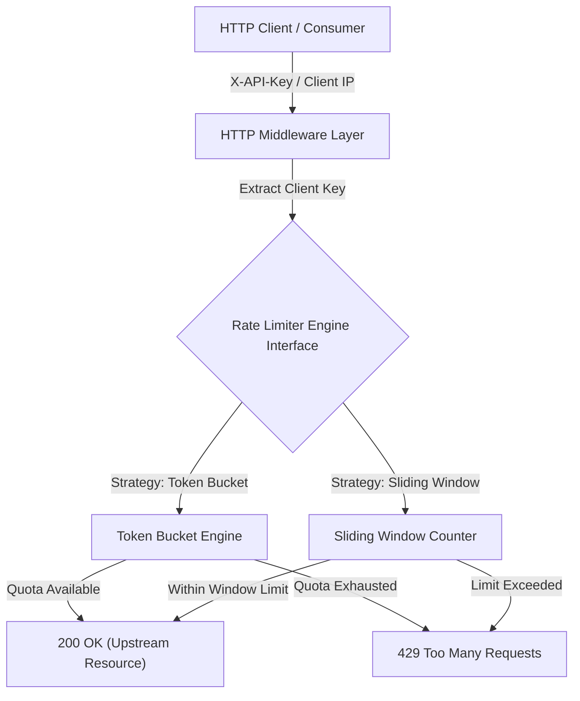

# distlimiter

[](https://golang.org)
[](LICENSE)
[](go.mod)

`distlimiter` is a high-throughput, thread-safe Distributed Rate Limiter and API Gateway middleware built in Go. It supports both **Token Bucket** and **Sliding Window Counter** algorithms, enforcing rate limits per API Key or Client IP address with standard IETF headers.

---

## ⚡ Performance Benchmarks

Designed for high-concurrency API Gateway environments with sub-millisecond overhead.

*Load tested over 10,000 concurrent HTTP requests across 50 worker threads:*

| Metric | Result |
|:---|:---|
| **Throughput** | **25,143 req/sec** |
| **Success Rate (200 OK)** | Enforced at exact quota limit |
| **Rejection Handling (429)** | Clean JSON error response + `Retry-After` header |
| **Error Rate** | **0.00%** unhandled errors |
| **Data Race Safety** | **0 race conditions (`go test -race`)** |

---

## 🏗️ Architecture



---

## ⚖️ Algorithm Trade-offs & Implementation

| Feature | Token Bucket (`internal/limiter/token_bucket.go`) | Sliding Window Counter (`internal/limiter/sliding_window.go`) |
|:---|:---|:---|
| **Traffic Profile** | Supports short burst capacity with steady token refill | Smooths out traffic spikes across window boundaries |
| **State Tracking** | Last refill timestamp + current token balance | Current window count + weighted previous window count |
| **Memory Efficiency** | $O(U)$ memory where $U$ = active user keys | $O(U)$ memory with automatic window rotation |
| **Boundary Protection** | Refill-rate constrained | Prevents 2x burst spike at window boundaries |

---

## 🚦 HTTP Response Specification

### Allowed Request (HTTP 200 OK)
```http
HTTP/1.1 200 OK
X-RateLimit-Limit: 100
X-RateLimit-Remaining: 99
X-RateLimit-Reset: 1.00
```

### Rate Limited Request (HTTP 429 Too Many Requests)
```http
HTTP/1.1 429 Too Many Requests
Content-Type: application/json
Retry-After: 2
X-RateLimit-Limit: 100
X-RateLimit-Remaining: 0
X-RateLimit-Reset: 1.45

{
  "error": "Rate limit exceeded",
  "status": 429,
  "retry_after_seconds": 2
}
```

---

## 💻 Quickstart

### 1. Build Binaries
```bash
make build
```

### 2. Run API Gateway Server
```bash
# Run with Token Bucket algorithm
./bin/distlimiter-server -port 8080 -algo token_bucket -limit 100

# Run with Sliding Window Counter algorithm
./bin/distlimiter-server -port 8080 -algo sliding_window -limit 100
```

### 3. Run Benchmark / Load Test
```bash
./bin/distlimiter-bench -url http://localhost:8080/api/v1/resource -n 10000 -c 50
```

---

## 🧪 Testing & Safety

Run unit test suite covering rate limiting logic, multi-user quota isolation, and HTTP header correctness:

```bash
make test
```

---

## 📜 License

Distributed under the MIT License. See [`LICENSE`](LICENSE) for details.
